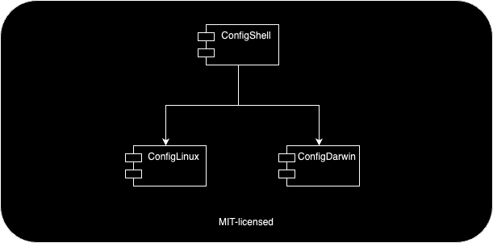

# Welcome to ConfigShell

March 2024

## Contents

- [Welcome to ConfigShell](#welcome-to-configshell)
  - [Contents](#contents)
  - [About](#about)
  - [Original Repository](#original-repository)
  - [Case Sensitivity](#case-sensitivity)
  - [Helpers by ConfigShell](#helpers-by-configshell)
    - [ConfigLinux](#configlinux)
    - [ConfigDarwin](#configdarwin)
  - [Contact](#contact)

## About

Welcome to our collection named *ConfigShell*. ConfigShell is a collection of scripts and helper routines which were created over the last 40 years. The first routines started still on SunOS.

Overall, all ConfigShell elements are under the MIT license. Furthermore, it splits into 3 parts:

1. The basic ConfigShell is appropriate for all UNIX™-like operating systems.
2. A special git sub-module for Linux-specifics called *ConfigLinux*
3. A special git sub-module for OSX-specifics called *ConfigDarwin*

The basic ConfigShell can be used without the sub-modules.

## Original Repository

The original ConfigShell can be found at https://github.com/engelch/ConfigShell

## Case Sensitivity

ConfigShell requires that it is installed as `/opt/ConfigShell`. Of course, this file can also be a symbolic link (s-link) to another directory.

The combination of upper- and lower-case characters is important. A more generic version existed before but as it increased the complexity of many scripts, this flexibility was removed.

## Helpers by ConfigShell

ConfigShell offers

1. Shell enhancements
   1. Nice shell defaults for bash
   2. Same kind of shell default for the fish shell
   3. Shell shortcut commands
2. Documentation and version control support
   1. LaTeX, Markdown, and Marp scripts
   2. git abbreviations
3. Development-specific support
   1. Utilities for go programming
   2. Script for creating container images
   3. Kubernetes (K8s) and EKS (AWS K8s) utilities
   4. Versioning support (based on bumpversion)
4. Connectivity and generic shell scripts
   1.  tmux scripts
   2.  route53 (AWS DNS) utility\
   3.  helper routines like `eir`, `rmbak`, `8601`, `ll`, `lla`, `llad`, and many others

Individual documents exist to introduce these enhancements. Please feel free to comment and to suggest improvements.

### ConfigLinux

The ConfigLinux sub-module is to be installed as `/opt/ConfigShell/ConfigLinux`. It contains enhancements like:

1. Binaries
   1. signfile
   2. fast SHA256 calculator
2. Terminal support
   1. gnome-terminal configurations
   2. icons for JetBrains applications for Linux X11/Wayland environments.

### ConfigDarwin

The ConfigDarwin sub-module is to be installed as `/opt/ConfigShell/ConfigDarwin`. It contains enhancements like:

1. Binaries
   1. signfile
   2. fast SHA256 calculator
2. Terminal support
   1. Mac Terminal Profiles
   2. iTerm profiles
3. Keyboard Maestro macro files for Unicode support like `\->` becomes to →. Classical LaTeX names and other reasonable ones.

## Contact

You can contact me as Christian ENGEL mailto:engel-ch@outlook.com.
