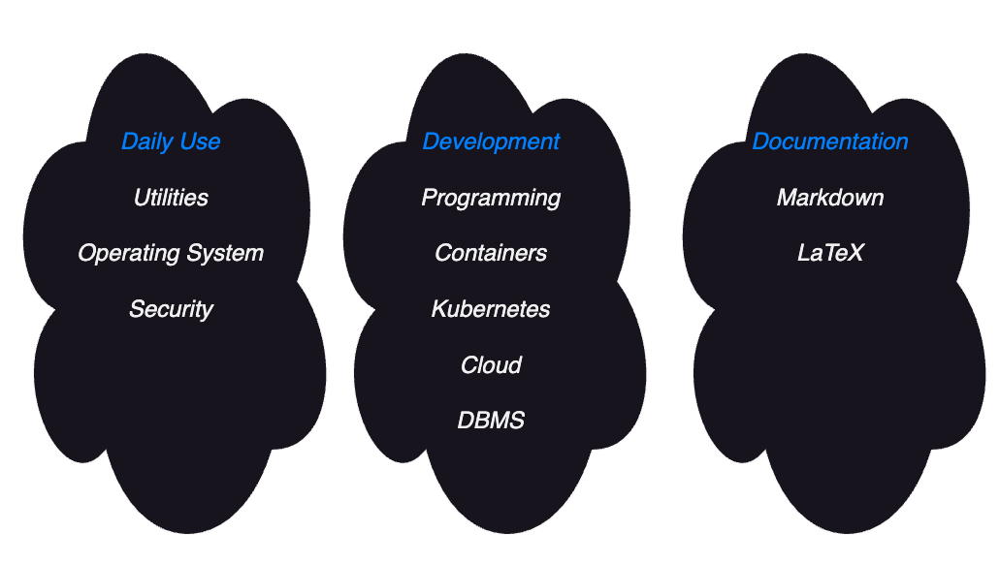
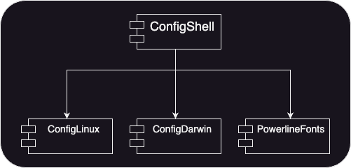

# Welcome to ConfigShell

April 2024

## Contents

- [Welcome to ConfigShell](#welcome-to-configshell)
  - [Contents](#contents)
  - [About](#about)
  - [Security Notice](#security-notice)
  - [License](#license)
  - [Modular, Optional Extensions](#modular-optional-extensions)
  - [Benefits of ConfigShell](#benefits-of-configshell)
    - [Daily Use Support](#daily-use-support)
    - [Documentation Support](#documentation-support)
    - [Development Support](#development-support)
    - [ConfigLinux](#configlinux)
    - [ConfigDarwin](#configdarwin)
  - [Installation of ConfigShell](#installation-of-configshell)
    - [Original Repository](#original-repository)
    - [Installation to /opt/ConfigShell](#installation-to-optconfigshell)
      - [Case Sensitivity](#case-sensitivity)
    - [Install Shell Integration](#install-shell-integration)
      - [Automatic Upgrade of ConfigShell](#automatic-upgrade-of-configshell)
      - [Verifying Installation](#verifying-installation)
  - [Contact](#contact)

[//]: # (delete before 4 LaTeX)

## About

Welcome to *ConfigShell*. *ConfigShell* offers you scripts and helper routines that were created over the last 40 years. 
The first bits were started still on SunOS, Ultrix, Xenix, and Microport UNIX. Some of you might still remember...

The scripts are supposed to run under Linux, OSX, Free-, Open-, and NetBSD, and other UNIX variants. These days, the scripts are only tested with Linux and OSX.

ConfigShell supports 3 major areas denoted here.



## Security Notice

**ConfigShell is script-only.**

I.e., it contains only scripts and / or configuration files. There are no binaries included in the  ConfigShell repository. So, you shall be able to see what every bit does.

This is different for the optional git submodules such as ConfigLinux and ConfigDarwin. ConfigShell can be used without the git submodules.

## License

This collection is under the MIT license.

## Modular, Optional Extensions



Overall, all *ConfigShell* elements are under the MIT license. Furthermore, it splits into multiple parts. These
parts are realised using git submodules:

1. The basic *ConfigShell* is appropriate for all UNIX™-like operating systems
2. A special git sub-module for Linux-specifics called *ConfigLinux*
3. A special git sub-module for OSX-specifics called *ConfigDarwin*
4. A git sub-module called *PowerlineFonts*

Again, the basic ConfigShell can be used without the sub-modules.

## Benefits of ConfigShell

### Daily Use Support

*ConfigShell* offers **Daily Use** shell support for the shells:

  1. bash (https://www.gnu.org/software/bash/) [GPLv3 license](https://www.gnu.org/licenses/gpl-3.0.html)
  1. fish (https://fishshell.com/) [GPLv2 based](https://fishshell.com/docs/current/license.html)
  2. zsh (https://zsh.org) [MIT license, parts with GPL](https://github.com/zsh-users/zsh/blob/master/LICENCE)

### Documentation Support

### Development Support


1. Documentation and version control support
   1. LaTeX, Markdown, and Marp scripts. You can check the `/opt/ConfigShell/doc` directory. It contains one Markdown file. It is formatted using classical 
      Markdown and LaTeX. Please, watch the difference. Both PDF files are created using a Makefile. 
      
      If you want to try, just change the `README.md` a bit and say make (with ConfigShell: it is just an `m`) in the `/opt/ConfigShell/doc` directory. Afterwards, the reset everything just say:

      ```bash  
      cd /opt/ConfigShell  # make sure that you are in ConfigShell
      git reset --hard
      ```
   2. git abbreviations
3. Development-specific support
   1. Utilities for go programming
   2. Script for creating container images
   3. Kubernetes (K8s) and EKS (AWS K8s) utilities
   4. Versioning support (based on bumpversion)
4. Connectivity and generic shell scripts
   1. tmux scripts
   2. route53 (AWS DNS) utility
   3. Additional helper routines like `eir`, `rmbak`, `8601`, `ll`, `lla`, `llad`, and many others

Individual documents exist to introduce these enhancements. Please feel free to comment and to suggest improvements.

### ConfigLinux

The ConfigLinux sub-module is to be installed as `/opt/ConfigShell/ConfigLinux`. It contains enhancements like:

1. Binaries
   1. signfile
   2. fast SHA256 calculator
2. Terminal support
   1. gnome-terminal configurations
   2. icons for JetBrains applications for Linux X11/Wayland environments.

### ConfigDarwin

The ConfigDarwin sub-module is to be installed as `/opt/ConfigShell/ConfigDarwin`. It contains enhancements like:

1. Binaries
   1. signfile
   2. fast SHA256 calculator
2. Terminal support
   1. Mac Terminal Profiles
   2. iTerm profiles
3. Keyboard Maestro macro files for Unicode support to allow for typing Nordic or German letters and math-symbols like:
   1.  `\->` becomes to →, and many more like this including `\leadsto`
   2.  `\ae` becomes to ä
   3.  `\"a` also becomes to an ä
   4.  `\(c)` becomes to a ©
   5.  ...

## Installation of ConfigShell

### Original Repository

The original ConfigShell can be found at https://github.com/engelch/ConfigShell

### Installation to /opt/ConfigShell

First check, if you can create a directory `/opt/ConfigShell`. You can do this by executing:

```bash
mkdir /opt/ConfigShell
```

If this fails because of permissions, either speak with your system administrator for help or if you also have this role, do:

```bash
sudo mkdir /opt/ConfigShell
sudo chown <<yourUserName>> /opt/ConfigShell
```

Now, you should be able to install ConfigShell using the command:

```bash
git clone https://github.com/engelch/ConfigShell /opt/ConfigShell
```

#### Case Sensitivity

ConfigShell requires that it is installed as `/opt/ConfigShell`. Of course, this file can also be a symbolic link (s-link) to another directory.

The combination of upper- and lower-case characters is important. A more generic version existed before but as it increased the complexity of many scripts, this flexibility was removed.

### Install Shell Integration

To install the shell integration just execute:

```bash
/opt/ConfigShell/installDotFiles2home
```

This command is understood to be idempotent, i.e. you can run it multiple times.

#### Automatic Upgrade of ConfigShell

We installed ConfigShell on many hosts. But, how to keep it up-to-date? Luckily, ConfigShell helps you with that. Just run the commands:

```bash
cd
[ ! -d .bashrc.d ] && mkdir .bashrc.d
cd .bashrc.d
ln -sf /opt/ConfigShell/bin/upgradeConfigShell.sh .
```

`~/.bashrc.d/*.sh` are executed by fish AND bash. They are run in a sub-shell. Note: `~/.bashrc.d/*.rc` are sourced by bash only. This approach was chosen to avoid duplication of installation steps for bash and fish.

Now, every time you log in, it is checked whether this command was executed in the last 4 hours. If so, it just terminates. Otherwise, it pulls the actual version of ConfigShell.

#### Verifying Installation

If possible, log in to the host with a new terminal. On the local system, just open another shell.

## Contact

You can contact me as Christian ENGEL via email: mailto:engel-ch@outlook.com
