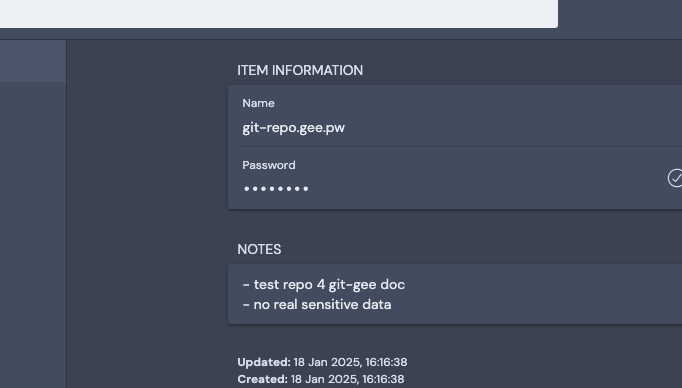

title: git gee |
  store sensitive data in git repositories
author: The ConfigShell Team
titlepage: true
...


## Version

0.1.0 describing git gee version 3.3.1.

## About

git gee allows for encryption of sensitive information in git repositories. It is a Shell-based extension for git, so it is compatible with all usual operating systems.

Alternative solutions such as git secret and git secrets are supposed to serve the same purpose.  The experience with these tools also allowed me to commit the sensitive files, but this is a no-go.  git gee is my implementation to solve this solution. It is used now for some years. As all parts of ConfigShell, it is under the MIT license.

## Installation

### ConfigShell-based Installation

The recommended installation is to use install ConfigShell using the following approach:

``` shell
sudo mkdir /opt/ConfigShell && \
sudo chown <<owner>> /opt/ConfigShell && \
git clone https://github.com/engelch/ConfigShell /opt/ConfigShell
```

Please replace `<<owner>>` with your username of the operating system.

### Manual Installation

If you only want to use git gee, you can also just download the `ConfigShell/bin/git/gee` file.  This file must be placed in a directory mentioned by your PATH variable. If you also want to call the command using `git gee` then s-link the file `git-gee` to the `gee` command or rename `gee` to `git-gee`. 

### Requirements

By default, `git gee` requires ansible-vault. 

## Tutorial - first steps with git-gee

### Putting a git Repository under git-gee

Image that you want to put the repository  `./git-repo` under git gee. As the first step, create an encyrption password.  `git gee` uses symmetric encryption. This allows you to add users at any time to the repository. Create a file with the name of the repository and the suffix `.gee.pw`. 

``` shell
./git-repo/README.md
./git-repo/secrets.txt
./git-repo.gee.pw
```

The file `fileWithSecretData.txt` is not yet committed to the repository. The .gee.pw file contains a one-liner like:

``` shell
jdlsakj0jlj_jdljsi39j90jeh280he902eegedh0hjgh2ejdkjdhjs
```

Yes, go for long passwords to get enough entropy.

As the next step, store the password in your password manager. 



To use `git gee` make sure that you are in a directory of the git repository and execute the command:

``` shell
$ git gee init
```

The command is idempotent. I.e., if you execute it one time or multiple times has the same effect. This command installs a hook pre-commit. If the execution was successful, no output is created and the exit code is 0.

Now, let's put the sensitive file under `git gee`. 

``` shell
$ git gee add secrets.txt
```

Whenever possible, you can limit the sub-command name to one or a few letters. The sub-command name must be identifiable uniquely.

``` shell
$ git gee a fileWithSecretData.txt
Processing file secrets.txt ->Encryption successful

$ ls
README.md
secrets.txt
secrets.txt.gee

$ git status
Changes to be committed:
  (use "git rm --cached <file>..." to unstage)
  new file:   README.md
  new file:   .gitignore
  new file:   secrets.txt.gee
```

You can also see that a file with the suffix `.gee` was produced. This is the encrypted version of the unencrypted file. Furthermore, the file `fileWithSecretData.txt` was added to the `.gitignore` file.  You can commit the project now. The gee version of the file, the `README.md`, and the `.gitignore` file will be committed.

### Changing the secret file - welcome to gist

Now, please edit the file `fileWithSecretData.txt` . If you do a `git status` , you will not see a potential change, but you can use `git gee status` or `gist` by ConfigShell.

``` bash
$ git status                                                                                 
On branch master
nothing to commit, working tree clean
$ git gee status                                                                             
./secrets.txt.gee (./secrets.txt existing, modified)
$ gist                                                                                       
On branch master
nothing to commit, working tree clean

git gee status:
./secrets.txt.gee (./secrets.txt existing, modified)
```

In our daily life, `gist`replaced the `git status` command.

The .txt file is now newer than the .txt.gee file. The pre-commit installed by the init command would block now further commits until you also updated the .gee files. I.e., the .gee files must also have a newer modification time than the corresponding normal files.

You can either now encrypt a special file or all files where the .gee file is older than the non-encrypted version.

``` bash
$ git gee e
Processing file ./secrets.txt ->Encryption successful
# or type git gee encrypt

$ gist
On branch master
Changes to be committed:
  (use "git restore --staged <file>..." to unstage)
	modified:   secrets.txt.gee

git gee status:
```

Rule of thumb: before leaving a git-gee-repository, please check with the `gist` command if all secret files are up to date and also committed (and pushed).

### Cloning a git-gee-repository

Now, the other way around:

``` bash
$ git clone https://<<URL>>/git-repo
$ echo -n 'jdlsakj0jlj_jdljsi39j90jeh280he902eegedh0hjgh2ejdkjdhjs' \
  > git-repo.gee.pw
$ cd git-repo
$ git gee init
$ git gee d    # decrypt
git gee de                                                                                   
Processing file .../secrets.txt.gee ->Decryption successful
# executing the same command, no action
$ git gee d
No action: .gee file and related file have the same age: .../git-repo/secrets.txt

```

A decrypt won't overwrite a changed secret file:

``` bash
$ echo 'new secret' >| secrets.txt
$ git gee de
WARNING: not decrypting .../secrets.txt.gee as the correspondig unencrypted file is younger
```

So, if you did changes to your files, git gee also protects you that changes files are not overwritten by git gee.

### Summary

You learned now about the options

- init
- add
- encrypt
- decrypt
- status

These are the only options which you require in 90% of all cases.

## Further git gee Options

### doc

For every source file under .gee, check if the source file (without .gee) is under .gitignore. If the source file is not found in `.gitignore` , add it to it.

This command is useful after you moved .gee files in the git repository. Otherwise, you have to fix the `.gitignore` by yourself.

### list

This command lists all files under git gee and shows if the non-encrypted counterpart exists and if so, if it is modified.

``` bash
git gee l                                                                                     
./secrets.txt.gee (./secrets.txt existing, modified)
```

### clean

This command deletes the unencrypted versions of gee files if they are older than the corresponding gee files. In force mode [ -f | --force ], delete the unencrypted files even if they are younger thane the corresponding gee files.

### hasBeenInstalled

If not installed, the exit code is unequal to 0. Otherwise, it is 0. This functionality is useful in scripts.

``` bash
$ git gee hasbeeninstalled                                                                    
git gee enabled
```

### Help

``` bash
git gee h       # or git gee help
```
