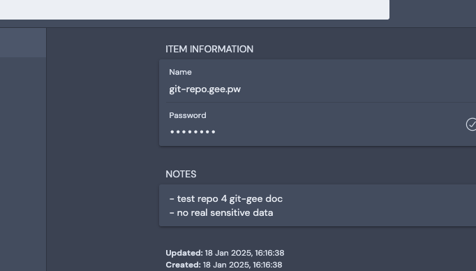

title: git gee |
  store sensitive files in git repositories
author: The ConfigShell Team
titlepage: true
header-includes:
- |
  ```{=latex}
  \ifdefined\DeclareUnicodeCharacter
    \DeclareUnicodeCharacter{2192}{\ensuremath{\rightarrow}}
    \DeclareUnicodeCharacter{2265}{\ensuremath{\geq}}
  \fi
  ```
...


## About

`git gee` is a small, shell-based git extension that keeps sensitive files (secrets, credentials, private keys, `.pws` files, …) in a git repository in **encrypted form only**. The plain-text version stays on disk for you to work with, is added to `.gitignore`, and a pre-commit hook makes sure you never commit a stale encrypted copy by accident.

It is part of [ConfigShell](https://github.com/engelch/ConfigShell) (`bin/git/gee`, reachable as `git gee`, `git-gee`, or `gee`) and is licensed under the MIT license.

This document describes `git gee` version **3.6.0**.

## Why git gee

Tools like `git-crypt`, `git secret`, and `git secrets` address the same problem. In practice they still made it possible to commit sensitive files unencrypted — which is a no-go. `git gee` is a deliberately simple alternative that has been in daily use for several years:

- **Nothing magic in git itself.** No filters, no smudge/clean drivers. The encrypted file is an ordinary tracked file with a `.gee` suffix; the plain-text file is an ordinary ignored file.
- **Symmetric encryption via `ansible-vault`.** One password per repository. New collaborators just need the password; no key management, no re-encryption for every new user.
- **A pre-commit hook as safety net.** If a plain-text file is newer than its `.gee` counterpart, the commit is blocked until you re-encrypt.
- **Pure Bash.** Runs on Linux and macOS alike.

## How it works

For every sensitive file `foo` under `git gee` there are two files:

| File      | Tracked by git | Content                                   |
|-----------|----------------|-------------------------------------------|
| `foo`     | no (`.gitignore`) | plain text — the file you edit          |
| `foo.gee` | yes            | `ansible-vault`-encrypted copy of `foo`   |

`git gee` compares **modification times** to decide what to do:

- `foo` newer than `foo.gee` → the secret was changed; `encrypt` will refresh `foo.gee`, `decrypt` refuses to overwrite `foo`, and the pre-commit hook blocks commits.
- `foo.gee` newer than `foo` (or `foo` missing) → someone else pushed a new secret; `decrypt` refreshes `foo` and sets its mtime equal to `foo.gee`.
- same mtime → nothing to do.

The encryption password is read from a **password file next to the repository**, never from inside it. If the repository root is `/a/b/repo`, the password file must be `/a/b/repo.gee.pw`.

A repository that has been initialised with `git gee init` carries a marker file `.git/gee`; all sub-commands except `init`, `help`, and `version` refuse to run without it.

## Installation

### Via ConfigShell (recommended)

```shell
sudo mkdir /opt/ConfigShell && \
sudo chown "$USER" /opt/ConfigShell && \
git clone https://github.com/engelch/ConfigShell /opt/ConfigShell
```

Then follow the ConfigShell README to add `/opt/ConfigShell/bin` to your `PATH`. `git gee`, `git-gee`, and `gee` are then all available.

### Stand-alone

Copy `bin/git/gee` to a directory in your `PATH`. To call it as `git gee`, additionally create a symlink or copy named `git-gee` in the same directory:

```shell
cp /path/to/ConfigShell/bin/git/gee ~/bin/gee
ln -s gee ~/bin/git-gee
```

### Requirements

- `bash` ≥ 4
- `git`
- `ansible-vault` (part of [Ansible](https://docs.ansible.com/)) — needed for `add`, `encrypt`, and `decrypt`
- standard tools: `tput`, `basename`, `dirname`, `readlink`, `find`, `sed`, `grep`, `mktemp`

## Quick start

### 1. Put a repository under git gee

Suppose the repository lives in `./git-repo` and contains a file `secrets.txt` that must never be committed in plain text.

Create the password file **next to** the repository — same name as the repository directory plus `.gee.pw` — containing one long, random line:

```shell
$ ls
git-repo/
$ openssl rand -base64 48 > git-repo.gee.pw
```

Store that password in your password manager; everyone who needs to read the secrets will need it.



Now initialise the repository (idempotent — safe to run again at any time, e.g. after a `git gee` upgrade):

```shell
$ cd git-repo
$ git gee init
```

This installs `.git/hooks/pre-commit` and creates the marker `.git/gee`. Success is silent with exit code 0.

### 2. Add a sensitive file

```shell
$ git gee add secrets.txt        # or: git gee a secrets.txt
Processing file secrets.txt ->Encryption successful

$ ls
README.md  secrets.txt  secrets.txt.gee

$ git status
Changes to be committed:
  new file:   .gitignore
  new file:   secrets.txt.gee
```

`git gee add` encrypts `secrets.txt` into `secrets.txt.gee`, stages the `.gee` file, appends `/secrets.txt` (root-relative) to `.gitignore`, stages `.gitignore`, and removes `secrets.txt` from the index if it was tracked before. Commit as usual.

### 3. Edit the secret and re-encrypt

After editing `secrets.txt`, plain `git status` shows a clean tree — git does not see ignored files. `git gee status` does, and so does `gist` (see [Companion commands in ConfigShell](#companion-commands-in-configshell)), which combines both views:

```shell
$ git status
nothing to commit, working tree clean

$ git gee status
./secrets.txt.gee (./secrets.txt existing, modified)

$ gist
On branch master
nothing to commit, working tree clean

git gee status:
./secrets.txt.gee (./secrets.txt existing, modified)
```

Trying to commit now is blocked by the hook:

```shell
$ git commit -m "update"
ERROR: ./secrets.txt newer than ./secrets.txt.gee
```

Re-encrypt everything that is out of date, then commit:

```shell
$ git gee encrypt                # or: git gee e
Processing file ./secrets.txt ->Encryption successful
$ git commit -m "update secrets"
```

### 4. Clone on another machine

```shell
$ git clone https://<host>/git-repo
$ echo -n '<password from password manager>' > git-repo.gee.pw
$ cd git-repo
$ git gee init
$ git gee decrypt                # or: git gee d
Processing file .../secrets.txt.gee ->Decryption successful
```

Running `decrypt` again does nothing; and if you had already changed `secrets.txt` locally, `decrypt` refuses to overwrite it:

```shell
$ git gee d
No action: .gee file and related file have the same age: .../secrets.txt

$ echo 'new secret' >| secrets.txt
$ git gee d
WARNING: not decrypting .../secrets.txt.gee as the correspondig unencrypted file is younger
```

Those five sub-commands — `init`, `add`, `encrypt`, `decrypt`, `status` — cover 90 % of daily use.

## Command reference

```
git gee [-D] [-v] [-h] [-V] <sub-command> [options] [file ...]
```

Sub-commands may be abbreviated as shown (`a` for `add`, `e` … `encrypt`, `d`/`de`/`dec` … `decrypt`, `u` … `unencrypt`, `l`/`li`/`list`/`lst`, `s`/`status`, `doc`/`doctor`, `h`/`help`, `ver`/`version`).

### Global options

| Option | Effect |
|--------|--------|
| `-D`   | debug output to stderr (also `DebugFlag=TRUE` in the environment) |
| `-v`   | verbose mode |
| `-h`   | show usage, exit 1 |
| `-V`   | print version, exit 3 |

Global options must come **before** the sub-command.

### `init`

```
git gee init
```

Requires the password file `<repo-dir>.gee.pw` to exist and be readable. Writes the pre-commit hook to `.git/hooks/pre-commit` (overwriting any existing hook — see [The pre-commit hook](#the-pre-commit-hook) for how to keep your own checks) and creates the marker `.git/gee`. Idempotent; re-run it after upgrading `git gee` to refresh the hook.

### `add` / `a`

```
git gee add <file> ...
```

For each plain file:

1. adds the root-relative path (`/path/to/file`) to `.gitignore` and stages `.gitignore` (warns if an entry already matches),
2. removes the file from the index (`git rm --cached`) if it was tracked,
3. encrypts it to `<file>.gee` and stages the `.gee` file.

Passing a `<file>.gee` name that already exists re-encrypts the corresponding plain file after an interactive `Do you want to overwrite? Y/n` prompt (default: yes). It errors out if the plain file is missing or older than the existing `.gee` file. Passing the plain-file name skips the question.

### `encrypt` / `e`

```
git gee encrypt [-f | --force] [<file> ...]
```

Re-encrypts each named file whose plain version is **newer** than its `.gee` counterpart and stages the result. Without file arguments, all `.gee` files in the repository are processed. Files can be named with or without the `.gee` suffix.

`-f` / `--force` re-encrypts regardless of modification times (useful after a password change or if you distrust mtimes).

### `decrypt` / `d` / `unencrypt` / `u`

```
git gee decrypt [-f | --force] [-s | --silent] [-fs] [--] [<file> ...]
```

Decrypts each `.gee` file into its plain counterpart if the plain file is missing or **older** than the `.gee` file, then sets the plain file's mtime to that of the `.gee` file. Without file arguments, all `.gee` files are processed.

| Option | Effect |
|--------|--------|
| `-f`, `--force`  | overwrite the plain file even if it is newer |
| `-s`, `--silent` | suppress the `No action:` and `WARNING: not decrypting` lines, leaving only real work visible |
| `-fs`, `-sf`     | both |
| `--`             | end of options |

### `status` / `s`

```
git gee status
```

Prints the lines of `list` that are marked `modified` — i.e. files that must be re-encrypted before the next commit. Exit code **0 if nothing is modified, 1 otherwise**, so it can be used in scripts and prompts.

### `list` / `l`

```
git gee list
```

Lists every `.gee` file from the repository root and, in parentheses, whether the plain version exists and whether it is modified:

```
./secrets.txt.gee (./secrets.txt existing, modified)
./config/db.pw.gee (./config/db.pw existing)
./old.key.gee
```

Exit codes: `0` all plain files present and up to date; `1` at least one plain file missing (not yet decrypted); `2` at least one plain file modified.

### `doctor` / `doc`

```
git gee doctor [-v | --verbose] [-n | --dry] [--]
```

Walks all `.gee` files and checks that the plain counterpart is listed in `.gitignore`; missing entries are appended. Entries are only ever added, never removed or changed. Run this after moving or renaming `.gee` files inside the repository, otherwise the renamed plain files would no longer be ignored. `-n` shows what would be added without writing (implies `-v`).

### `clean` / `c`

```
git gee clean [-f | --force]
```

Deletes the plain-text versions of all `.gee` files, e.g. before leaving a shared machine. Without `-f` it aborts on the first plain file that is newer than its `.gee` file (unsaved secret changes); with `-f` it deletes them anyway.

### `hasBeenInstalled`

```
git gee hasBeenInstalled
```

Prints `git gee enabled` and exits 0 if the current repository has been initialised, otherwise prints `git gee not installed` and exits 1. Intended for scripts (see [Companion commands in ConfigShell](#companion-commands-in-configshell)). Case-insensitive variants `hasbeeninstalled` and `hasbeenInstalled` are accepted.

### `version` / `ver`

Prints the version (e.g. `3.6.0`) and exits 0. `git gee -V` does the same but exits with 3.

### `help` / `h`

Prints the usage text to stderr and exits 1.

## The pre-commit hook

`git gee init` installs `.git/hooks/pre-commit`. On every `git commit` it:

1. **Checks `.pws` files.** Every file named `*.pws` in the repository must be a symbolic link; a regular `.pws` file aborts the commit with exit code 2. (Convention in ConfigShell: `*.pws` are password-store files that must point elsewhere, never live in the repository.)
2. **Checks `.gee` freshness.** For every `*.gee` file whose plain counterpart exists, the plain file must not be newer than the `.gee` file. Otherwise: `ERROR: <plain> newer than <gee>` and exit code 1.
3. **Chains to your own hook.** If a file `pre-commit.sh` exists in the repository root, it is executed with `bash` and its exit code becomes the hook's result. Put project-specific checks there — `git gee init` will overwrite `.git/hooks/pre-commit`, but never `pre-commit.sh`.

To commit anyway (e.g. an unrelated file while a secret is still being edited), bypass hooks with `git commit -n` / `--no-verify`.

### Version alignment

The hook carries a header `# gee:version:3.6.0`. Every `list`, `status`, `encrypt`, `decrypt`, and `doctor` call compares that against the running `git gee` version and refuses to continue on mismatch:

```
pre-commit hook version is: 3.3.1
git gee version is: 3.6.0
Please align
```

Fix: run `git gee init` again in that repository. Exit codes: 20 no hook installed, 21 hook has no version header, 22 version mismatch.

## Exit codes

| Code | Meaning |
|------|---------|
| 0    | success (for `status`: nothing modified) |
| 1    | usage/help shown; `status`: modified files exist; `list`: plain files missing; `hasBeenInstalled`: not initialised |
| 2    | unknown global option; `list`: modified files exist |
| 3    | `-V` version printed |
| 10 / 11 | unknown / missing sub-command; 11 also: not in a git repository |
| 12   | not a `git gee` repository (no `.git/gee`) — run `git gee init` |
| 20–22 | pre-commit hook missing / unversioned / version mismatch |
| 30–31, 39 | `init`: password file missing / unreadable / hook could not be written |
| 40–47 | `add` errors (file missing, not a plain file, refused overwrite, encryption or `git add` failure) |
| 60–67 | `ansible-vault` wrapper errors (bad arguments, password or source file not a plain file, temp-file/encryption/move failure) |
| 70–71 | `decrypt`: `.gee` file missing / decryption failed |
| 90–92 | `clean`: plain file newer than `.gee` (no `-f`) / delete failed; `doctor`: unexpected argument / cannot `cd` to root |
| 100–101 | `encrypt`: `.gee` file missing / encryption or `git add` failed |
| 252–255 | required directory / binary / file not found |

## Companion commands in ConfigShell

These ConfigShell scripts integrate `git gee` into everyday git work — `gist`, `gipl`, and `gisw` detect a `git gee` repository (via `.git/gee`) and act accordingly, while `gipu` and `gipua` round out the pull/push workflow:

### gist

`git status` replacement. Appends a `git gee status:` section listing files that still need re-encryption:

```shell
$ gist
On branch master
nothing to commit, working tree clean

git gee status:
./secrets.txt.gee (./secrets.txt existing, modified)
```

Rule of thumb: run `gist` before leaving a repository and make sure both sections are clean and pushed.

### gipl

`git pull` replacement (alias `git-pl`). Pulls, fetches all tags, and then runs `git gee decrypt -s` so freshly pulled secrets are immediately usable — silent mode keeps only the files that were actually decrypted visible.

### gipu

`git push` replacement (alias `git-pu`). Pushes the current branch **and all tags** — plain `git push` alone would leave tags behind. Without arguments it pushes to the default remote; with arguments it pushes to each named remote in turn:

```shell
$ gipu                 # push current branch + tags to the default remote
$ gipu origin backup   # push current branch + tags to origin, then to backup
```

Remember that `.gee` files are ordinary tracked files — after `git gee encrypt` and a commit, a normal push (e.g. `gipu`) is all it takes to share the updated secrets.

### gipua

Like `gipu`, but pushes **all local branches** (`git push --all`) plus all tags (alias `git-pua`). Same argument handling: default remote without arguments, or each named remote in turn. Useful for keeping a mirror or backup remote complete.

### gisw

`git switch` replacement (alias `git-sw`). Switches branch, pulls, and runs `git gee decrypt` if `git gee status` reports differences.

## Caveats and good practice

- **The password file is the key to everything.** Keep `<repo>.gee.pw` out of any repository and out of backups you do not control; store the password in a password manager.
- **Modification times are the source of truth.** Tools that reset mtimes (some sync clients, `git checkout` of the `.gee` file, `cp` without `-p`) can make a stale plain file look fresh or vice versa. When in doubt, use `git gee encrypt -f` or `git gee decrypt -f` deliberately.
- **`.gitignore` matching is by substring.** `add` and `doctor` check with `grep`, so a broad existing pattern (e.g. `*.pw`) counts as "already ignored". Individual root-anchored entries (`/path/file`) are what `git gee` itself writes.
- **Moved a `.gee` file?** Run `git gee doctor` afterwards so the plain counterpart at the new location is ignored as well.
- **Temporary files** are created with `mktemp` in `$TMPDIR` (default `/tmp`) during encryption/decryption and removed on exit; the destination file never holds plain text during encryption.
- **Bypassing the hook** with `git commit -n` is legitimate for unrelated commits, but check `gist` before pushing.

## Changelog

| Version | Change |
|---------|--------|
| 3.6     | `decrypt -s` / `--silent` and combined `-fs`; used by `gipl` |
| 3.5     | `git gee -V` works |
| 3.4     | `git gee add <file>.gee` re-encrypts after a confirmation prompt; plain name skips the question |
| 3.2     | `hasBeenInstalled` sub-command |
| 3.1     | `doctor -v` less chatty for correct entries |
| 3.0     | `doctor` introduced |
| 2.4     | version header in pre-commit hook, checked against `git gee` version |
| 2.3     | subshell fix |
| 1.0     | initial release |

---

© 2022 - 2026 – Christian Engel · MIT License
