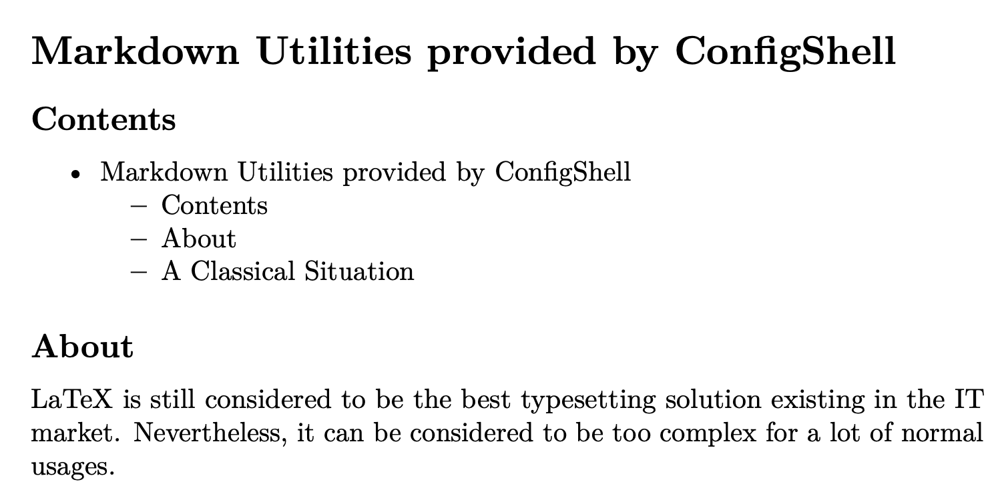
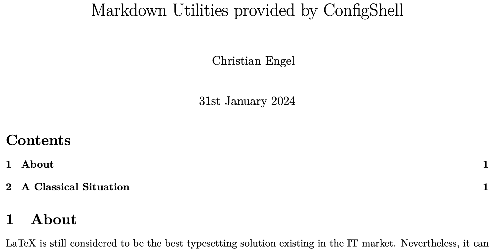

# Markdown Utilities provided by ConfigShell

## Contents

- [Markdown Utilities provided by ConfigShell](#markdown-utilities-provided-by-configshell)
  - [Contents](#contents)
  - [About](#about)
  - [Version](#version)
  - [A Classical Situation](#a-classical-situation)
  - [Further Advantages of `md2pdf`](#further-advantages-of-md2pdf)
    - [Use of default LaTeX tool](#use-of-default-latex-tool)
    - [Unicode Support](#unicode-support)
    - [Short markdown file names](#short-markdown-file-names)
    - [Language-specific Support](#language-specific-support)
    - [Link-colours](#link-colours)
    - [Definition of default paper-sizes](#definition-of-default-paper-sizes)
    - [Automatic add of documentation at the end](#automatic-add-of-documentation-at-the-end)
  - [`md2pdf` options](#md2pdf-options)

[//]: # (delete before 4 LaTeX)

## About

LaTeX is still considered to be the best typesetting solution existing in the IT market. Nevertheless, it can be considered to be too complex for a lot of normal usages.

Markdown can be considered as a simplified version of a batch formatting system such as LaTeX. Its rules are much easier to learn than the ones of LaTeX and TeX. ConfigShell provides scripts to convert and format Markdown documents to the interim format LaTeX and then to PDF. This combines the easiness of Markdown with with excellent formatting of LaTeX. This wonderful process is supported by the OSS tool [pandoc](https://pandoc.org).

The scripts and templates provided by ConfigShell shall help to use this tool-chain more effectively.

## Version

This document is version: `1.1.0`.
It describes the `md2pdf` software in its version `1.1.0` and above.

## A Classical Situation

Image you format a Markdown document like this:

```text
  # Markdown Utilities provided by ConfigShell

  ## Contents

  You might use an automatic table of contents (TOC) as
  created by tools such as typora or vscode (extension: Markdown
  all in One)

  ## About
  ...
```

With this automatic TOC this might look like:

```text
  # Markdown Utilities provided by ConfigShell
  
  ## Contents
  
  - [Markdown Utilities provided by ConfigShell](#markdown-utilities-provided-by-configshell)
    - [Contents](#contents)
    - [About](#about)
    - [A Classical Situation](#a-classical-situation)
  
  ## About
  ...
```

If such a document is stored as a `README.md` file, then many git repository front-ends would automatically format this document and it all looks ok.
Often, we are interested to format this Markdown file also the PDF. Then, even local clones of this directory can be used to display this Markdown file in a well looking form.

But, if we want to format this document to PDF using [pandoc](https://pandoc.org), we run into some challenges:

- No LaTeX title, author is defined
- The table of contents is based on Markdown, not LaTeX: by far not so beautiful as it could, as it should be.
- Only one section exists. This is supposed to be the title. All *normal* elements are subsections and below.

Here is an example how it looks like:



This is where `md2pdf` (same as `markdown2pdf`) comes into the game.
Let's use the ConfigShell tool to format it:

```shell
md2pdf README.pdf
```

And here the output:



We can see:

- The markdown title is the LaTeX title
- The LaTeX table of contents macro is used
- All sections and below are on the right level

## Further Advantages of `md2pdf`

### Use of default LaTeX tool

It uses LaTeX instead of xelatex for a higher level of compatibility. Some problems with larger levels of table of contents structures were detected with xelatex. You can change this behaviour by options to pandoc or a wrapper script around pandoc. `md2pdf` offers the variable `PANDOC_OPTIONS` for this. By default, the variable is not set.

### Unicode Support

- It extends LaTeX to allow for the use of Unicode characters. For example, the use of ≥ and ≤ are made possible in the LaTeX header file by entries like:

```
    \DeclareUnicodeCharacter{2264}{$\leq$}
    \DeclareUnicodeCharacter{2265}{$\geq$}
```

### Short markdown file names

Instead of specifying the full name like `markdownFile.md`, you can just specify `markdownFile.`; the `md2pdf` command will automatically add the `md` suffix. This helps in case of completion topics.

### Language-specific Support

LaTeX is currently set to support UK English, this is controlled by the settings:

```
    \usepackage[UKenglish]{babel}
    \usepackage[UKenglish]{isodate}
```

You can easily change this to different languages by copying this header file, change these entries, and finally calling `md2pdf` with the option:

```bash
md2pdf -H ./doc/useThisHeaderfile.tex file.md
```

### Link-colours

Link colours and other formatting options can also be set in the header file. The default settings are shown here:

```
    \usepackage{hyperref}
    \hypersetup{
        colorlinks,
        citecolor=green,
        filecolor=blue,
        linkcolor=blue,
        urlcolor=red
    }
```

### Definition of default paper-sizes

The used sizes for papers (e.g. letter or DIN A4,...) do not change to often for a team. Here, a definition is created in the header file and automatically applied to all documents:

```
    \usepackage[a4paper, total={6.5in, 10in}]{geometry}
```

### Automatic add of documentation at the end

The option `-F` allows to add text at the end of a document. You can use this to add disclaimers, copyright information, ... to all documents easily.

## `md2pdf` options

`md2pdf` is a bash script residing in `/opt/ConfigShell/bin`.  It main options can be retrieved by the built-in help functionality:

```bash
NAME
    md2pdf

SYNOPSIS
    md2pdf [-D] [dir...]
    md2pdf [-V]
    md2pdf -h

VERSION
    1.1.0

DESCRIPTION
    Convert a markdown file to PDF using pandoc. This version works more stable when using
    classical LaTeX instead of xelatex. The starting position is: The markdown file can be
    formatted by itself and is 'good looking'. No LaTeX commands are included. But:
    Elements of the source markdown file before the comment
```

 $$ \texttt{[//]: \# (demo)} $$ 

```
    will be deleted when processing using pandoc. Additionally, if a file header_tex.yaml
    exists, this file is prepended to the stripped markdown file. Furthermore, a file named
    footer_tex.tex is appended for pandoc processing if it exists.
    Usually, the header file contains a LaTeX title and a table of contents declaration which
    will end up in better looking LaTeX/PDF version. The names of the header and footer files
    can be changed for CLI options. A local headerfile overwrites a default headerfile.

    Further options can be passed to the pandoc command using the environment
    variable PANDOC_OPTIONS. This environment variable is not double-quoted, so it can contain
    multiple options.

OPTIONS
    -H <<file>> ::= optional headerfile with YAML, LaTeX commands,
                    default: header_tex.yaml
    -F <<file>> ::= append the markdown file with the following LaTeX file if the file exists.
                    default: footer_tex.tex
    -D          ::= enable debug output
    -V          ::= output the version number to stderr and exit with 0
    -x          ::= disable LaTeX processing. This is useful if the markdown file shall be
                    formatted to look nice in LaTeX. Only one section (#) is allowed which
                    is translated into a LaTeX title. All other sections below (e.g. subsection (##))
                    will be moved one level up.
    -h          ::= show usage message to stderr and exit with 0
```
